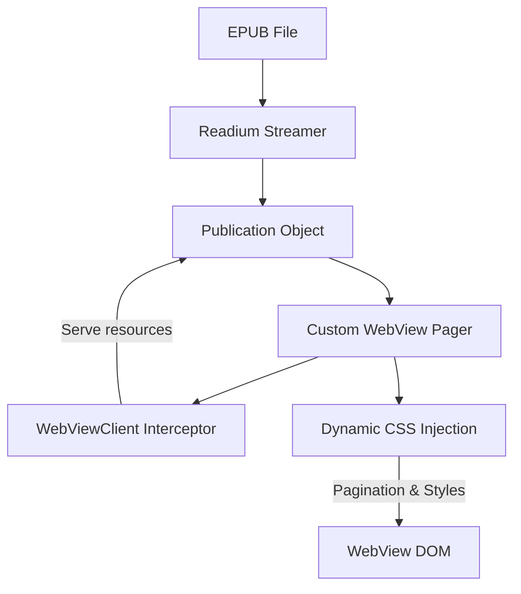

# PRD: Readium Navigator Migration

## 1. Objective

Replace the `readium-navigator` dependency with a custom, lightweight, e-ink-optimized WebView pager while retaining `readium-streamer` for EPUB parsing and metadata extraction.

**Related docs.** Read alongside this PRD:

- `docs/PRD.md` — project north star, e-ink interaction rules (animation ban, ≥48dp touch targets).
- `docs/READIUM_API.md` — Readium surface reference. Current Gradle pin is 3.2.0; verify any API assumptions against the pinned version before implementation.
- `docs/KINDLE_TYPOGRAPHY.md` — Kindle-style "layout mine, fonts yours" split underlying §3.5.

## 2. Problem Statement

The current Readium Navigator (`EpubNavigatorFragment` + ViewPager) is hostile to e-ink screens and hard to customize:

- **Forced Animations:** ViewPager smooth scrolls and swipe animations trigger high-frequency screen updates, causing severe smearing and ghosting on e-ink.
- **Styling Overhead:** ReadiumCSS uses aggressive `!important` declarations, overriding publisher formatting and user preference changes.
- **CORS Font Issues:** WebView asset serving triggers browser CORS failures, necessitating heavy base64 font injection workarounds.
- **Vertical Margins:** Page margin settings in Readium only affect horizontal margins; top and bottom margins are hardcoded to `0`.

## 3. Proposed Architecture

We will decouple the parsing and rendering layers. `readium-streamer` handles the backend lifecycle of the EPUB file, and our custom `WebView` component handles the rendering surface.



The migration keeps Readium where it is strongest (opening real EPUBs and exposing the reading order/resources) while removing the layer that currently constrains Kanshu's reading surface: `readium-navigator`, `EpubNavigatorFragment`, ReadiumCSS, and the navigator preference pipeline.

### 3.1 Custom Request Interceptor

To load chapter content and assets, the WebView will point to a virtual host (`https://kanshu.invalid/`). A custom `WebViewClient` intercepts book requests and serves bytes from a session-local resource cache populated from the Streamer's `Publication` model plus APK assets:

- Prevents socket port binding overhead.
- Resolves CORS failures by keeping all book content, fonts, and stylesheets under the same origin.
- Blocks all non-book network requests by default (`webView.settings.blockNetworkLoads = true`) and returns explicit 403 responses for non-Kanshu hosts.
- Normalizes relative URLs against the active spine item and rejects path traversal.
- Preserves MIME types for XHTML, CSS, images, and fonts.

Readium's `Resource.read()` API is suspending, while `WebViewClient.shouldInterceptRequest(...)` is synchronous. The interceptor must not directly call suspend APIs from WebView's request thread without a bounded bridge.

The implementation uses a hybrid resource strategy:

- **Chapter document preload only:** before `WebView.loadUrl(...)`, read the current spine XHTML document once through Readium, sanitize it, wrap it in the Kanshu shell, and store those bytes as the current chapter document response. This gives the ViewModel a synchronous error boundary: if the chapter document cannot be read or wrapped, transition to `ReaderUiState.Error` before WebView displays a blank/network-error surface. To maintain concurrent-read safety, the preload read serializes through the session-scoped `readLock` Mutex, but **only for the `resource.read()` call itself**. Sanitization and shell-wrapping run outside the lock so the previous chapter's in-flight sub-resource reads do not stall behind preload CPU work during a chapter switch.
- **Lazy sub-resources:** CSS, images, EPUB fonts, and APK-bundled fonts are loaded on demand through `shouldInterceptRequest(...)`. V1 does not parse XHTML or CSS in Kotlin to discover and warm sub-resources.
- **Memory safety:** never preload the whole book. Large images and uncommon sub-resources are lazy-loaded.
- **No disk-backed cache:** assets are read from either the EPUB-backed `Publication` resources or the APK `AssetManager`; duplicating them into a temp cache adds cleanup bugs without clear benefit.
- **Concurrent-read safety:** Readium 3.x's ZIP-backed containers may share archive state. Lazy fallback reads are serialized through a session-scoped `Mutex` shared by all `KanshuWebViewClient` instances in the reader session. The critical section is exactly the `resource.read()` call; byte handling, MIME inference, and response construction run outside the lock so a chapter-doc preload (which uses the same lock) cannot stall the previous chapter's in-flight sub-resource reads. Cost is acceptable unless measurement proves otherwise; if it fails, optimize specific hot resources rather than adding broad preloading.
- **Reserved asset routing:** app-bundled fonts and Kanshu-owned CSS do not live in the EPUB manifest, so they must be served from `AssetManager` under a reserved path such as `https://kanshu.invalid/__kanshu__/...` before attempting `publication.linkWithHref(...)`. The `__kanshu__` prefix is never resolved against the EPUB manifest, avoiding collisions with common EPUB paths such as `assets/foo.png`.
- **Kanshu stylesheet:** `features/reader/app/src/main/assets/kanshu-reader.css` is loaded through `<link rel="stylesheet" href="https://kanshu.invalid/__kanshu__/kanshu-reader.css">` in the shell. Bundled `@font-face` rules in that stylesheet reference fonts through `https://kanshu.invalid/__kanshu__/fonts/...`, using the same asset route.
- **Fragment handling:** `url.path` excludes the fragment (`#anchor`) and query string; WebView resolves fragments client-side after the chapter document loads. The interceptor does not need to serve fragments, but the reader must sync Kotlin `pageIndex` after anchor navigation (§3.8).
- **Local link routing:** `shouldOverrideUrlLoading(...)` intercepts link clicks:
  - Same-chapter fragment links (e.g., `chapter.xhtml#section-2` or `#footnote-1`) must return `false` to let WebView perform native anchor scrolling/jumping, which the bridge then reports.
  - Cross-chapter and cross-book links must return `true` to cancel WebView navigation and route through Kotlin (e.g., calling `go(position)` or triggering TOC/spine transitions).
  - External/web links must return `true` to block direct WebView loads (though blocked by `blockNetworkLoads`, this provides an early UI/routing hook).
- **Chapter sanitization:** the preload pass sanitizes publisher chapter bytes with the §3.10 allowlist before WebView sees them, then wraps the sanitized content in the trusted Kanshu shell. The Kanshu shell (including the `__kanshu__/kanshu-reader.css` link and bridge script injection) is added after sanitization and is not subject to publisher-link stripping rules. JavaScript stays enabled because the §3.9 bridge requires Kanshu-injected JS, but only Kanshu's shell script should execute.
- **Chapter-vs-sub-resource errors:** a failed sub-resource (image, font, sub-CSS) can render as a missing asset. A failed chapter document must route to `ReaderUiState.Error`. Because interception happens off the main thread, error callbacks must dispatch onto the ViewModel/main scope before mutating UI state. Specifically, the client overrides `onReceivedError(...)` and `onReceivedHttpError(...)`. When `request.isForMainFrame` is `true`, it immediately dispatches the failure to the ViewModel's scope to transition the UI to `ReaderUiState.Error`. Errors on non-main-frame requests (sub-resources) fail silently.
- **CORS headers:** all local responses should include `Access-Control-Allow-Origin: *`. Same-origin fonts should work without CORS, but WebView/intercepted-response behavior can be strict; adding the header keeps APK-served fonts and EPUB resources on the same reliable path.
- **Cache headers:** all local responses, including `assetResponse(...)`, set `Cache-Control: no-store`. Kanshu's interceptor remains the deterministic source of truth; WebView should never serve stale intercepted bytes from its heuristic HTTP cache after CSS or asset updates.
- **Chapter-switch cancellation:** every `webView.loadUrl(...)` uses a chapter URL carrying the current load id, e.g. `https://kanshu.invalid/OEBPS/chapter01.xhtml?__kanshu_load=42`. When intercepting chapter documents, `shouldInterceptRequest(...)` extracts this token and compares it to `activeChapterLoadId`. If the token is stale or missing on a chapter document request, the request is rejected with `notFound()`. Sub-resources (images, fonts, stylesheets) are served without requiring or validating the `__kanshu_load` token, as WebView naturally cancels pending sub-resource requests when navigating to a new page.
- **Path normalization contract:** before routing, percent-decode the path once, collapse repeated `/`, reject empty paths for chapter loads, reject `.` or `..` segments after decoding, reject backslashes, null bytes, and control characters, resolve relative `.` and `..` segments to clean the path relative to the root, and **strip any leading slash**. Return `null` on any rejection. We do NOT resolve the path against the active spine item's base path, because WebView already resolves relative URLs relative to the document URL before making the request; the interceptor receives a path that is absolute relative to the domain (representing the EPUB archive root). Stripping the leading slash is required because Readium `href` paths (e.g., `currentChapter.path` and manifest links) are relative to the package root and lack leading slashes, so comparison and `publication.linkWithHref(path)` lookup would otherwise fail.
- **Load URL contract:** Kotlin always loads a concrete spine-item URL such as `https://kanshu.invalid/OEBPS/chapter01.xhtml`; `https://kanshu.invalid/` is invalid and returns 403 rather than redirecting to the first spine item.

```kotlin
// Pseudo-code: final implementation must use the exact Readium Url/Resource APIs.
data class CachedResource(
  val path: String,
  val loadId: Int,
  val bytes: ByteArray,
  val mimeType: String,
)

// A new client instance is created and assigned to webView.webViewClient on every chapter switch
// to ensure clean lifecycle isolation and reset the active load ID state. The readLock itself is
// session-scoped and shared by all clients so Publication reads remain serialized.
class KanshuWebViewClient(
  private val context: Context,
  private val publication: Publication,
  private val readLock: Mutex,
  private val currentChapter: CachedResource,
) : WebViewClient() {
  @Volatile private var activeChapterLoadId: Int = currentChapter.loadId

  override fun shouldInterceptRequest(
    view: WebView,
    request: WebResourceRequest,
  ): WebResourceResponse? {
    val url = request.url
    if (url.scheme != "https" || url.host != "kanshu.invalid") return forbidden()
    if (request.method != "GET") return forbidden()

    val path = normalizeAndRejectTraversal(url.path.orEmpty()) ?: return forbidden()
    if (path.startsWith("__kanshu__/")) {
      return assetResponse(context, path.removePrefix("__kanshu__/"))
    }

    val isChapterDoc = path == currentChapter.path
    if (isChapterDoc) {
      val loadId = url.getQueryParameter("__kanshu_load")?.toIntOrNull()
      if (loadId != activeChapterLoadId) return notFound()
      return ok(currentChapter.mimeType, currentChapter.bytes)
    }

    val href = readiumUrlFromPath(path)
    val link = publication.linkWithHref(href) ?: return notFound()
    val isSpineChapterDoc = link.mediaType?.let {
      it.matches("application/xhtml+xml") || it.matches("text/html")
    } == true
    if (isSpineChapterDoc) {
      // Direct navigation to other chapters inside WebView is forbidden; route through Kotlin.
      return forbidden()
    }

    return try {
      val bytes = publication.get(link)?.use { resource ->
        runBlocking(Dispatchers.IO) {
          readLock.withLock { resource.read().getOrNull() }
        }
      } ?: return notFound()

      val extension = path.substringAfterLast('.', missingDelimiterValue = "")
      val mimeType =
        link.mediaType?.toString()
          ?: MimeTypeMap.getSingleton().getMimeTypeFromExtension(extension)
          ?: "application/octet-stream"
      val encoding = responseEncoding(mimeType)
      WebResourceResponse(
        mimeType,
        encoding,
        200,
        "OK",
        localHeaders(),
        ByteArrayInputStream(bytes),
      )
    } catch (e: Exception) {
      Log.e("WebViewClient", "Failed to load resource: $path", e)
      notFound()
    }
  }

  private fun forbidden(): WebResourceResponse =
    WebResourceResponse(
      "text/plain",
      "UTF-8",
      403,
      "Forbidden",
      localHeaders(),
      ByteArrayInputStream(ByteArray(0)),
    )

  private fun notFound(): WebResourceResponse =
    WebResourceResponse(
      "text/plain",
      "UTF-8",
      404,
      "Not Found",
      localHeaders(),
      ByteArrayInputStream(ByteArray(0)),
    )

  private fun ok(mimeType: String, bytes: ByteArray): WebResourceResponse =
    WebResourceResponse(
      mimeType,
      responseEncoding(mimeType),
      200,
      "OK",
      localHeaders(),
      ByteArrayInputStream(bytes),
    )

  private fun responseEncoding(mimeType: String): String? =
    when {
      mimeType.startsWith("text/") -> "UTF-8"
      mimeType.contains("xml") -> "UTF-8"
      mimeType == "application/javascript" -> "UTF-8"
      else -> null
    }

  private fun localHeaders(): Map<String, String> =
    mapOf(
      "Access-Control-Allow-Origin" to "*",
      "Cache-Control" to "no-store",
    )
}
```

### 3.2 CSS Multi-Column Pagination

We layout the active chapter inside a Kanshu-owned shell. Publisher XHTML is inserted inside `#kanshu-page`; Kanshu owns legibility, spacing, and page geometry through CSS variables.

The CSS below lives in `features/reader/app/src/main/assets/kanshu-reader.css` and is linked from the shell rather than inlined into every chapter. WebView re-requests the stylesheet and fonts through the local `__kanshu__` route on each chapter load; those asset reads are cheap and avoid stale WebView cache behavior.

The shell template is the contract between sanitizer, CSS, and bridge:

```html
<!DOCTYPE html>
<html lang="<!-- publication language, fallback en -->">
  <head>
    <meta charset="utf-8" />
    <meta name="viewport" content="width=device-width, initial-scale=1" />
    <!-- sanitized publisher stylesheet links slot -->
    <!-- placeholder: injected publisher <link rel="stylesheet"> tags go here -->
    <link
      rel="stylesheet"
      href="https://kanshu.invalid/__kanshu__/kanshu-reader.css"
    />
  </head>
  <body>
    <main id="kanshu-page">
      <!-- sanitized publisher chapter HTML -->
    </main>
  </body>
</html>
```

The `chapterLoadId` is injected by the §3.9 shell script with `evaluateJavascript(...)` after load rather than embedded into publisher-derived HTML.

```css
:root {
  --reader-font: "Literata-Kanshu";
  --font-size: 18px;
  --line-height: 1.5;
  --text-align: justify;
  --page-margin-inline: 24px;
  --page-margin-block: 32px;
  --paragraph-spacing: 0;
  --word-spacing: 0;
  --letter-spacing: 0;
}

html,
body {
  height: 100% !important;
  margin: 0 !important;
  padding: 0 !important;
  overflow: hidden !important;
}

#kanshu-page {
  width: 100vw !important;
  height: 100vh !important;
  box-sizing: border-box !important;
  padding: var(--page-margin-block) var(--page-margin-inline) !important;
  column-width: calc(100vw - (2 * var(--page-margin-inline))) !important;
  column-gap: calc(2 * var(--page-margin-inline)) !important;
  column-fill: auto !important;
  font-family: var(--reader-font), serif !important;
  font-size: var(--font-size) !important;
  line-height: var(--line-height) !important;
  text-align: var(--text-align) !important;
  touch-action: pan-y !important;
}

#kanshu-page *:not(code):not(pre) {
  font-family: var(--reader-font), serif !important;
}

#kanshu-page p,
#kanshu-page li,
#kanshu-page blockquote {
  line-height: var(--line-height) !important;
  text-align: var(--text-align) !important;
  word-spacing: var(--word-spacing) !important;
  letter-spacing: var(--letter-spacing) !important;
}

#kanshu-page p {
  margin-block: var(--paragraph-spacing) !important;
}

#kanshu-page h1 {
  font-size: calc(var(--font-size) * 1.5) !important;
}

#kanshu-page h2 {
  font-size: calc(var(--font-size) * 1.3) !important;
}

#kanshu-page h3 {
  font-size: calc(var(--font-size) * 1.2) !important;
}

#kanshu-page h4 {
  font-size: calc(var(--font-size) * 1.1) !important;
}

#kanshu-page h5 {
  font-size: var(--font-size) !important;
}

#kanshu-page h6 {
  font-size: calc(var(--font-size) * 0.9) !important;
}

#kanshu-page img,
#kanshu-page figure {
  float: none !important;
}

#kanshu-page img,
#kanshu-page svg {
  max-width: 100% !important;
  max-height: calc(100vh - (2 * var(--page-margin-block))) !important;
  object-fit: contain !important;
}
```

This directly fixes the ReadiumCSS margin issue: top/bottom and left/right margins are first-class variables owned by Kanshu, not body rules hidden inside ReadiumCSS. Legibility overrides must target descendants directly because inherited parent styles lose to publisher rules such as `p { font-family: ... }`; parent-only `!important` is not enough.

**Variable-weight font footnote.** The current `font` → `--reader-font` mapping (§3.4) resolves to a single `font-family` name. The bundled fonts (Literata, Bitter, Libre Baskerville) are variable-weight files; their `@font-face` sources use `__kanshu__/fonts/...`, and their weight cascade is currently driven by publisher CSS rules within Kanshu's family override. Dedicated `font-weight` / `font-variation-settings` controls are a future setting, not a V1 requirement.

Set the WebView background color at construction (`Color.WHITE` or the active reader background) so the pre-first-paint frame does not flash a platform-default color.

### 3.3 Zero-Animation Page Navigation

- Swiping or tapping the outer edge zones (the larger of 15% screen width per side or 48dp, per the project's e-ink touch-target rule) shifts the horizontal scroll position instantly:
  ```kotlin
  fun nextPage() {
    val next = (pageIndex + 1).coerceAtMost(pageCount - 1)
    pendingTarget = next
    webView.evaluateJavascript("kanshu.scrollToPage($next)", null)
  }
  ```
- No smooth scroll, no ViewPager animation, no transition frames.
- Target one visible e-ink update after layout is stable, while accepting that WebView can invalidate again after late image/font layout.
- Chapter boundaries are explicit: next page at the end of a chapter loads the next spine item at page `0`; previous page at page `0` loads the previous spine item at its last page.
- Navigation crosses the bridge as a **page index**, never a pixel offset. Kotlin calls `kanshu.scrollToPage(index)`; the shell script computes `index * window.innerWidth` in JS and issues `window.scrollTo(...)`. Keeping the multiplication on the JS side avoids DPR drift between `WebView.width` (device pixels) and `window.innerWidth` (CSS pixels), which would otherwise land scrolls off the column boundary and look like §3.9 feedback-guard violations. Bridge reports read `window.scrollX` and `window.innerWidth` from the same JS context.
- Android `View.scrollTo(...)` is not used because it can move the WebView surface without updating the DOM scroll container measured by the bridge.
- Native horizontal WebView drag scrolling is disabled: CSS sets `touch-action: pan-y`, and the WebView `OnTouchListener` consumes horizontal drags outside tap zones. All page movement is Kotlin-initiated: Kotlin sets `pendingTarget` before calling `evaluateJavascript`, and `pageIndex` is updated only when confirmed by the §3.9 bridge.
- **Hardware page keys:** the Compose host forwards hardware page-key events to `goForward()` / `goBackward()` before WebView focus consumes them. Boox devices emit page-turn presses as `KEYCODE_PAGE_UP` / `KEYCODE_PAGE_DOWN` (dedicated page buttons) or `KEYCODE_VOLUME_UP` / `KEYCODE_VOLUME_DOWN` depending on the model; the host handles both. Key events route through the same command-serialization queue as tap/swipe input — they are not a separate path.

### 3.4 Dynamic Settings Injection

Preferences are applied by calling `kanshu.applySettings({...}, settingsRevision)` via `evaluateJavascript(...)`. The shell script captures `progressInSpine` before mutating CSS variables on `:root`, applies the updates atomically, and runs the §3.9 settling protocol. Kotlin never writes CSS variables directly — all settings flow through this single entry point so capture-before-mutate is enforced and `settingsRevision` always travels with the change.

Settings updates preserve the user's rough location by storing progression through the current spine item before relayout, then scrolling to the corresponding page after `pageCount` recalculates.

```kotlin
data class ReaderPosition(
  val schemaVersion: Int = 1,
  val spineIndex: Int,
  val pageIndex: Int,
  val progressInSpine: Float,
)
```

`ReaderPosition` replaces Readium `Locator` as the local reader's runtime position model. The `BookViewController.currentLocator: Flow<Locator>` contract changes to `Flow<ReaderPosition>` in V1; `ReaderViewModel`, `RemoteProgressPrompt`, and the Kavita progress sync path adopt the new type.

Persisted `ReaderPosition` is stored in Room `reading_progress.locator_json` as kotlinx.serialization JSON, replacing the current Readium locator JSON shape. The column name stays `locator_json` as a legacy name; update the entity comment to say it now stores `ReaderPosition` JSON. Decoder config uses `ignoreUnknownKeys = true` so V1 builds tolerate future fields. New fields must be nullable or have defaults; never make older `schemaVersion` values fail to decode. On read, if parsing the JSON fails, the reader falls back silently to `ReaderPosition(schemaVersion = 1, spineIndex = 0, pageIndex = 0, progressInSpine = 0f)`. Since Kanshu is a solo developer project with no production users, database migrations are skipped entirely; the Room database schema or JSON encoding format can be modified directly, and clearing local app storage or reinstalling the app is the expected method to reset the database when changes are introduced.

`ReaderPosition.schemaVersion` lives inside the JSON blob and tracks the data-class shape. Room's database `schema_version` tracks the SQL schema. The two are unrelated; bumping `ReaderPosition.schemaVersion` does not require a Room migration unless the SQL column shape changes.

Cold starts, process death, and configuration changes restore only from the last settled, persisted `ReaderPosition`. `pendingTarget`, `pendingRepaginate`, and in-flight bridge reports are runtime-only and are never persisted.

First open of a book with no `reading_progress` row starts at `ReaderPosition(schemaVersion = 1, spineIndex = 0, pageIndex = 0, progressInSpine = 0f)`. The first settled bridge report populates the row.

`ReaderPreferences` fields map to CSS variables as follows. Adding a new setting in V1 means adding one row to this table — no closed-enum surface like Readium's `EpubPreferences`.

| `ReaderPreferences` field | CSS variable                                  | Notes                                                                                                        |
| ------------------------- | --------------------------------------------- | ------------------------------------------------------------------------------------------------------------ |
| `font`                    | `--reader-font`                               | Resolves to a single `font-family` name; bundled fonts ship via `@font-face` in the Kanshu-owned stylesheet. |
| `fontScale`               | `--font-size`                                 | Multiplied against a 16px base; emitted as a `px` value.                                                     |
| `margins`                 | `--page-margin-inline`, `--page-margin-block` | `ReaderMargins` enum (`Small`/`Medium`/`Large`) → dp pair, emitted as `px`.                                  |
| `alignment`               | `--text-align`                                | `justify` or `left`.                                                                                         |
| `lineSpacing`             | `--line-height`                               | Unitless.                                                                                                    |
| `paragraphSpacing`        | `--paragraph-spacing`                         | `em`.                                                                                                        |
| `wordSpacing`             | `--word-spacing`                              | `em`.                                                                                                        |
| `letterSpacing`           | `--letter-spacing`                            | `em`.                                                                                                        |

### 3.5 Publisher CSS Policy

Kanshu should not pass publisher CSS through unbounded. The reader follows the Kindle-style split documented in `docs/KINDLE_TYPOGRAPHY.md`. Each category has an explicit mechanism — not a wish:

| Category                         | Examples                                                                                                            | Mechanism                                                                                                                                                                                                                                                                                                                                                                                                                                                                                                              |
| -------------------------------- | ------------------------------------------------------------------------------------------------------------------- | ---------------------------------------------------------------------------------------------------------------------------------------------------------------------------------------------------------------------------------------------------------------------------------------------------------------------------------------------------------------------------------------------------------------------------------------------------------------------------------------------------------------------- |
| **Preserve structural CSS**      | Headings, lists, blockquotes, emphasis, semantic block layout                                                       | Pass-through. Publisher CSS files load via the interceptor unchanged.                                                                                                                                                                                                                                                                                                                                                                                                                                                  |
| **Override legibility CSS**      | `font-family`, `font-size`, `line-height`, page margins, paragraph block spacing, `text-align`, word/letter spacing | Kanshu shell rules target `#kanshu-page` and key descendants (`p`, `li`, headings, blockquotes) with `!important`. Parent inheritance alone is insufficient against publisher child selectors. Inline indents/margins on text containers are preserved when present so publisher paragraph-indent style can survive.                                                                                                                                                                                                   |
| **Constrain fragile layout CSS** | Fixed body widths, oversized media, absolute/fixed positioning                                                      | Kanshu shell resets body/page geometry and media bounds with `!important`. Position resets are scoped to known-bad selectors (e.g., `body[style*="position:fixed"]`) or to **fallback repair mode** — triggered when measured chapter content height is 0 or scroll-width clamps to one page despite multi-page content, running a one-time DOM walk to strip `position: fixed`/`absolute` and oversized inline widths. No global `position: static`. DOM-walk stripping reserved for cases override can't fix (rare). |
| **Constrain float layout**       | `float: left/right` images and figures inside chapter content                                                       | Kanshu shell resets media floats with `float: none !important`. Inline alignment may be lost, but column flow stays predictable on e-ink.                                                                                                                                                                                                                                                                                                                                                                              |
| **Block remote resources**       | `@import` from remote URLs, `url(http://...)` images, web fonts                                                     | `blockNetworkLoads = true`; interceptor returns 403 for any host other than `kanshu.invalid`. No DOM rewrite needed; CSS that references blocked URLs simply renders without them.                                                                                                                                                                                                                                                                                                                                     |
| **Cover page rendering**         | `<svg>`-only or single-image first spine items                                                                      | Detected via `Publication` metadata + manifest type. Rendered in a separate `#kanshu-cover` shell that drops text-page margins so the image fills the screen.                                                                                                                                                                                                                                                                                                                                                          |

### 3.6 Boox EPD Integration

The "e-ink-optimized" goal in §1 may require Onyx's EPD API, not animation removal alone. Stock Android `WebView` refresh behavior can leave residual content on Boox panels regardless of scroll style. The Onyx SDK exposes view/application update-mode controls through `EpdController`; the migration should treat these modes as an empirical Boox tuning surface, not a compile-time assumption.

- Add the Onyx Maven repository to `settings.gradle.kts` / `build.gradle.kts`:
  ```kotlin
  maven { url = URI("https://repo.boox.com/repository/maven-public/") }
  ```
- Add a `:libs:onyx` module only after pinning the exact SDK artifact, repository, and license. Candidate from Onyx's public demo: `com.onyx.android.sdk:onyxsdk-device:1.1.11` from `https://repo.boox.com/repository/maven-public/`. **Verification step** (owner: the PR introducing `:libs:onyx`): the chosen artifact and version must be tested against a Boox-manufactured device before merge; pin the verified version in that PR's commit message so future bumps have a baseline. Older public Maven references such as `com.onyx.android.sdk:epdcontroller:0.1.0` are JCenter-era and should not be used without re-verification.
- Define an `EinkPageTurner` interface; provide `BooxEinkPageTurner` (calls `EpdController`) and `NoOpEinkPageTurner` (default).
- Select the impl at startup via `Build.MANUFACTURER.equals("ONYX", ignoreCase = true)`; non-Boox devices fall back to no-op so the rest of the app stays hardware-agnostic. All Onyx SDK calls and WebView mutations must execute on the main (UI) thread.
- Page-turn hook applies the chosen update mode to the `WebView` synchronously before issuing the `evaluateJavascript("window.scrollTo(...)")` command; see async sequence below.
- Settings-change reflows apply the chosen mode before issuing the CSS-variable mutation command; see settings sequence below.
- Test `GU` (16-level grayscale partial update), `REGAL` (text-oriented partial update), and occasional `GC` (16-level grayscale full-screen cleanup). Do not assume `GU` is a full refresh.
- Async JS scroll sequence: call `EpdController.setViewDefaultUpdateMode(webView, mode)` synchronously, then queue `window.scrollTo(...)` with `evaluateJavascript(...)`. The JS task runs asynchronously and triggers a View repaint that consumes the already-set update mode; the mode flag persists until changed, so no extra scheduling delay is needed.
- Async settings sequence: call `EpdController.setViewDefaultUpdateMode(webView, mode)` synchronously, then queue the CSS-variable updates with `evaluateJavascript(...)`. JS mutates the CSS variables, WebView reflows/repaints using the already-set update mode, then the §3.9 settling protocol fires `onRepaginated(...)`. Kotlin clears `pendingRepaginate` on that callback and may reset the reader WebView's update mode to a low-cost baseline so later incidental WebView redraws (late image/font layout, consumed gesture residue) do not keep using the high-refresh mode chosen for the explicit turn. Chrome surfaces such as bottom sheets and TOC lists are different Views and use their own mode independent of the reader WebView.

Without this section the pager is "more controllable than Readium" but may still ghost. With it, the reader has a concrete path to Boox-native refresh behavior once the best update mode is measured on target hardware.

### 3.7 CJK / Vertical Writing Stance

The project's name and target audience imply Japanese support, but the `column-width: 100vw` shell in §3.2 only paginates horizontal LTR text correctly. EPUBs declaring `writing-mode: vertical-rl` (common for Japanese light novels) break under the current shell — columns become row strips.

- **V1 supports horizontal LTR only.** CJK content laid out horizontally renders correctly; vertical writing mode is deferred.
- **V1.1 follow-up:** add a row-mode pager toggle keyed off explicit content signals: chapter CSS/inline `writing-mode: vertical-rl`, package metadata, and language hints (`ja`, `zh`). Metadata alone is not enough. The follow-up swaps the CSS shell to vertical writing with row-based pagination. Known-shape extension, not a redesign.
- V1 must fail gracefully when opening a vertical-mode publication: no crash, no silently corrupted position. Emit a one-time warning to the user and fall back to horizontal layout.

### 3.8 Table of Contents

TOC entries come from Streamer via `publication.tableOfContents` (which already merges EPUB 3 `nav.xhtml` and EPUB 2 NCX). The custom pager only needs to translate a TOC `Link.href` into a `ReaderPosition`.

- Resolve `href` → spine index by walking `publication.readingOrder` and matching normalized (percent-decoded, fragment-stripped) paths.
- Preserve any fragment (`#chapter-3-h2`) by handing it to WebView after the spine item loads; WebView resolves anchors client-side without interceptor work.
- After anchor navigation, ask the WebView for `scrollX`, `scrollWidth`, and viewport width, then derive `pageIndex` and `progressInSpine` from the actual settled position. Do not assume fragment jumps land on page `0`.
- Fragment jumps can settle mid-column. After the initial `Repaginated` event reports an anchor-settled `restoredPageIndex` mid-column, Kotlin computes `pageIndex = floor(scrollX / viewportWidth)` and issues one corrective `kanshu.scrollToPage(pageIndex)`. This corrective snap belongs to the same `pendingTarget` cycle defined in §3.9; it is not a second user-visible page turn.
- Anchor-jump chapter loads typically resolve the fragment during initial layout, so `Repaginated` fires once with the anchor-settled position. When WebView resolves the anchor _after_ the settling protocol observes stable `scrollWidth`, `Repaginated` first reports page `0`, then a follow-up `PageSettled` fires at the anchor position. `pendingTarget` survives the intervening `Repaginated` and clears when the anchor-matching `PageSettled` arrives.
- For TOC entries without fragments, start at `ReaderPosition(spineIndex, pageIndex = 0, progressInSpine = 0f)`. The first page-count measurement after load will clamp `pageIndex` if needed.
- TOC UI surface is unchanged: existing `TocIndex` and reader chrome consume the same `publication.tableOfContents` data. Engine swap is invisible to TOC rendering.

### 3.9 WebView-to-Kotlin State Bridge

The custom pager must keep Kotlin-side `ReaderPosition` synchronized with WebView layout and scroll state, including anchor jumps and settings-triggered repagination.

- Register a small `JavascriptInterface` on the reader WebView.
- The shell script lives at `features/reader/app/src/main/assets/kanshu-reader.js` and is injected with `evaluateJavascript(...)` on chapter load.
- On every chapter load, Kotlin injects a monotonically increasing `chapterLoadId` into the shell script. `chapterLoadId` is a process-lifetime counter starting at `0`, incremented on every new chapter load, not persisted across process restart, and not derived from `spineIndex`.
- Injection is one combined `evaluateJavascript` call: `"window.__kanshuChapterLoadId__ = ${N}; \n${shellScriptBody}"`. The chapterLoadId statement runs before any shell-script code so the script can read it during initialization; there is no observable window where it is undefined.
- Bridge reports include `chapterLoadId`; Kotlin ignores reports whose token does not match the active chapter load. Kotlin attaches the current `spineIndex` on receipt rather than trusting duplicated spine state from JS.
- The shell script reads `scrollX`, `scrollWidth`, and viewport width internally, computes `pageIndex` and `progressInSpine` with the progress math below, and reports only the derived values to Kotlin after `hashchange`, programmatic `scrollTo`, and debounced `scroll` events. Initial chapter `load` is reported via `Repaginated`, not `PageSettled`, so Kotlin always learns `pageCount` before any navigation is allowed (see Initial chapter measurement below).
- **Initial chapter measurement:** the repagination settling protocol runs after every chapter `load`, not only after settings changes. JS emits one `Repaginated` event carrying `pageCount`, `restoredPageIndex` (`0`, the anchor-resolved index from a TOC fragment jump, or the persisted `pageIndex` if Kotlin requested restoration), `settingsRevision` (current value, unchanged), and `stalled` status. This is the single signal that the new chapter is measured and ready for navigation. Until it arrives, Kotlin queues page-turn input per §3.10 but does not issue scroll commands — `nextPage()` / `previousPage()` have no defined `pageCount` to clamp against before this event.
- Debounce scroll reports to avoid noisy callbacks during WebView layout; page turns are instant, but anchor resolution and image/font layout can still produce multiple scroll/layout events.
- Treat bridge reports as state synchronization only. Navigation commands still originate in Kotlin (`goForward`, `goBackward`, `go(position)`), then JS reports the settled result.
- Both navigation commands and bridge reports use DOM scroll (`window.scrollTo(...)` / `window.scrollX`), never Android `View.scrollTo(...)`.
- Progress math uses scrollable width, not total width, and guards single-page chapters: `maxScrollX = (scrollWidth - viewportWidth).coerceAtLeast(0)`; progress is `0f` when `maxScrollX == 0`, otherwise `(scrollX / maxScrollX).coerceIn(0f, 1f)`. Page index math uses flooring to resolve the active page: `pageIndex = Math.floor(scrollX / viewportWidth)` in JS and `floor(scrollX / viewportWidth)` in Kotlin.
- Repagination settling: after CSS-variable changes, JS races `document.fonts.ready` against a 500ms timeout, then waits for two consecutive `requestAnimationFrame` callbacks with unchanged `scrollWidth`, capped at 2s. JS captures `progressInSpine` immediately before mutating CSS variables, applies the updates, waits for layout to settle, computes the new `maxScrollX`, and scrolls to `progressInSpine * newMaxScrollX` (snapped to the nearest page boundary) before reporting the new state and calling `onRepaginated(...)`. On the 2s cap, JS reports the current state with `stalled = true`; Kotlin clears `pendingRepaginate`, logs the stall, and keeps the reader usable. Repagination is interruptible: Kotlin increments a monotonically increasing `settingsRevision` before issuing the CSS-variable mutation, passes that revision into the shell script, and restarts the settling checks when a newer settings command arrives. The shell script echoes the current revision back in `onRepaginated(...)`; Kotlin discards any bridge report whose revision does not match the current pending revision. Sequential queueing of settings is avoided to ensure instant responsiveness during adjustments.
- Guard against feedback loops:
  1. Kotlin stores a `pendingTarget` before issuing a programmatic scroll.
  2. Kotlin calls DOM `window.scrollTo(...)` through `evaluateJavascript(...)`.
  3. JS reports the settled position through the bridge.
  4. Kotlin clears `pendingTarget` when the reported position matches it, and updates the last settled position.
  5. Kotlin ignores bridge reports that match the last settled position (preventing redundant updates) or have a stale `settingsRevision` or `chapterLoadId`.
  6. Kotlin issues another programmatic scroll only when the requested target differs from the last settled position.

```kotlin
sealed interface BridgeEvent {
  data class PageSettled(
    val chapterLoadId: Int,
    val pageIndex: Int,
    val progressInSpine: Float,
  ) : BridgeEvent

  data class Repaginated(
    val chapterLoadId: Int,
    val settingsRevision: Int,
    val pageCount: Int,
    val restoredPageIndex: Int,
    val stalled: Boolean,
  ) : BridgeEvent
}

class KanshuJsBridge(private val emit: (BridgeEvent) -> Unit) {
  @JavascriptInterface
  fun onPageSettled(chapterLoadId: Int, pageIndex: Int, progressInSpine: Float) {
    emit(BridgeEvent.PageSettled(chapterLoadId, pageIndex, progressInSpine))
  }

  @JavascriptInterface
  fun onRepaginated(
    chapterLoadId: Int,
    settingsRevision: Int,
    pageCount: Int,
    restoredPageIndex: Int,
    stalled: Boolean,
  ) {
    emit(BridgeEvent.Repaginated(chapterLoadId, settingsRevision, pageCount, restoredPageIndex, stalled))
  }
}
```

### 3.10 V1 Guardrails / Non-Goals

#### Lifecycle Invariants

- Persist only the last settled `ReaderPosition`; never persist `pendingTarget`, `pendingRepaginate`, or speculative page state.
- Any Activity recreation (cold start, process death, or system-driven configuration change of any kind) reopens the book at the last settled `ReaderPosition` and lets the bridge report the new settled position after layout.
- Boox tablets rarely rotate, so this cold-reopen path is rarely user-visible there. On non-Boox tablets that rotate, the brief blank during Activity recreation is acceptable for V1.
- If the app backgrounds during an in-flight turn, the WebView may complete the queued DOM scroll while suspended. On resume, the bridge reports the actual settled position and Kotlin syncs `ReaderPosition` to that value; pending runtime flags are not persisted.
- Handle `WebViewClient.onRenderProcessGone(...)`: destroy and recreate the WebView, show retry/error UI, keep the last persisted `ReaderPosition` as the recovery point, and return `true` so Android does not terminate the host process.
- Renderer crash recovery preempts the serialization queue: reset `pendingTarget`, `pendingRepaginate`, queued repeat taps, and all in-flight flags in `onRenderProcessGone(...)`. The recreated WebView starts with an empty command queue and replays only the last settled `ReaderPosition`.
- Do NOT use `WebView.saveState(...)` / `restoreState(...)`. Android's default Bundle-based WebView state save races our `ReaderPosition` restore — it restores scroll position from a stale bundle, triggering a corrective `scrollTo` and a visible intermediate frame, or conflicts with `loadUrl` so the chapter never loads. The host fragment/activity must skip WebView state in `onSaveInstanceState`; `ReaderPosition` from Room is the only authoritative restore source.
- `AndroidView` disposal must stop loading, clear the `JavascriptInterface`, remove callbacks/listeners, detach the WebView from its parent, call `webView.destroy()` on the detached View, and avoid leaking the old WebView across recompositions or process-death restore. Recommended calls: `webView.stopLoading()`, `webView.removeJavascriptInterface("kanshuBridge")`, `webView.setOnTouchListener(null)`, cancel any coroutine scope holding the WebView, remove pending callbacks, set `webView.webViewClient = WebViewClient()` (no-op instance; do not use `null` on older OEM ROMs without verification), detach with `(webView.parent as? ViewGroup)?.removeView(webView)`, then `webView.destroy()`.

#### Command Serialization

- Allow one in-flight navigation or repagination command at a time.
- During an in-flight page turn, keep at most one queued same-direction repeat tap. Fast double-tap next lands at page + 2; unbounded tap buffering is not allowed.
- In-flight turns cannot be cancelled once `window.scrollTo(...)` is queued. Opposite-direction page input clears any queued same-direction repeat and queues one opposite turn after the in-flight turn settles. Example: next, next, previous from page `N` lands back at `N`; tapping previous again then lands at `N - 1`.
- If a settings change arrives while another settings change is settling, the active settling checks are invalidated by a newer `settingsRevision`, the new variables are applied, and a new settling cycle is started. Settings updates do not block or queue sequentially; the latest change always supersedes the in-flight repagination.
- If a TOC/anchor jump or settings change arrives while a page turn is in flight, cancel the page-turn queue and make the explicit jump/settings operation the new `pendingTarget`/`pendingRepaginate`.
- Operation priority, highest first: settings change, TOC/anchor jump, page turn. Higher-priority operations cancel queued lower-priority operations but cannot abort an already-issued DOM scroll or repagination. The one exception is a newer settings change, which supersedes the active settings settling cycle by revision and causes stale repagination reports to be ignored.
- Fallback repair is part of chapter-load processing, not a separate command. User input arriving during repair is queued and processed after repair and initial settling complete.

#### Bridge Security

- Sanitization uses Jsoup with a custom Safelist covering the elements/attributes below; the same dependency is reused by fallback DOM repair so no second HTML library lands. The implementation PR must explicitly add and justify the Jsoup dependency.
- Jsoup's `clean(...)` by default strips the structural `<html/head/body>` tags and returns a body fragment. The implementation must preserve this wrapper structure (either by using Jsoup's parser and cleaning nodes selectively, or by explicitly whitelisting the structural `html`, `head`, `body`, and `<meta charset>` tags in a custom `Safelist` and using a full-document parse configuration) so that the sanitized output remains a well-formed HTML document containing the head elements.
- Sanitization walks the entire publisher document (`<head>` and `<body>`). Whitelisted `<link rel="stylesheet">` elements survive in `<head>`; everything else not on the allowlist is stripped regardless of location. The allowlist is grouped by category:
  - Block/structure: `p`, `div`, `section`, `article`, `aside`, `header`, `footer`, `nav`, `blockquote`, `figure`, `figcaption`, `br`, `hr`.
  - Headings/lists: `h1`-`h6`, `ul`, `ol`, `li`, `dl`, `dt`, `dd`.
  - Inline semantics: `span`, `a`, `em`, `strong`, `i`, `b`, `u`, `s`, `sub`, `sup`, `code`, `pre`, `mark`, `small`, `cite`, `q`, `dfn`, `abbr`, `time`, `address`, `bdi`, `bdo`.
  - Ruby/furigana: `ruby`, `rt`, `rp`. These are critical for Japanese reading aids and must not be stripped.
  - Media/tables: `img`, static `svg`, `table`, `thead`, `tbody`, `tfoot`, `tr`, `td`, `th`, `caption`.
  - Head links: local `<link rel="stylesheet">` only.
- Strip `<script>`, `<base>`, `<iframe>`, `<object>`, `<embed>`, and `<meta http-equiv="refresh">`. Strip inline event-handler attributes and `javascript:` URLs. Strip SVG scripting/animation surfaces such as SVG `<script>`, event attributes, `foreignObject`, animated elements, and `use href="javascript:..."`.
- Attribute policy: on ``, allow `src`, `alt`, `title`, `width`, and `height` when `src` resolves to a local publication resource. `srcset` and `sizes` may be preserved only if every `srcset` candidate URL resolves locally through the same path-normalization rules; otherwise strip them. Strip `crossorigin`, `referrerpolicy`, `usemap`, event-handler attributes, and any source resolving to a non-`kanshu.invalid` host. On `<a>`, allow `href` only for local fragments, local publication resources, or `__kanshu__` paths; strip remote, `javascript:`, `data:`, and `mailto:` links.
- Publisher `<style>` blocks and `style` attributes may be preserved only after removing `@import` with non-local URLs, `url(javascript:...)`, remote `url(http://...)` / `url(https://...)` not targeting `kanshu.invalid`, legacy `expression(...)`, and legacy `behavior: url(...)`. Sanitization scrubs CSS at the declaration level; unsafe declarations are removed individually. Strip the entire `<style>` block only when the CSS parser fails to recover.
- Sanitization preserves layout-affecting inline styles (`position`, `transform`, dimensions, floats) unless they contain the security-relevant constructs above. Fragile layout is handled at render time by the §3.5 shell and fallback repair; sanitizer stripping is for script/remote-URL safety.
- Publisher stylesheet links are preserved only when their `href` resolves to a local publication resource through the same path-normalization rules as the interceptor; remote or malformed stylesheet links are stripped.
- The Javascript bridge exposes only primitive state-report methods (`chapterLoadId`, page/count/progress values). It never exposes file, network, database, or settings mutation APIs.
- Kotlin rejects bridge reports whose `chapterLoadId` does not match the active chapter load.
- Bridge reports are observations, not commands. Navigation, repagination, and TOC jumps originate only in Kotlin; the bridge cannot request them.

#### Onyx Failure Behavior

- The Onyx integration must fail closed: if SDK classes are missing, methods throw, the device is not `Build.MANUFACTURER == "ONYX"`, or the artifact is incompatible with the ROM, use `NoOpEinkPageTurner` and keep the reader functional.
- `:libs:onyx` is compiled into the single APK. Availability is resolved once at `:libs:onyx` initialization with `runCatching { Class.forName("com.onyx.android.sdk.api.device.epd.EpdController") }` and cached as a Boolean. Subsequent `EinkPageTurner` calls read the cached flag and route to `BooxEinkPageTurner` or `NoOpEinkPageTurner` without re-probing. The rest of the app only sees `EinkPageTurner`; direct `EpdController` references are confined to `:libs:onyx`.

#### Fallback Repair Bound

- Fallback DOM repair runs at most once per chapter load, completes before the §3.9 settling protocol starts, and is capped at 200ms. If repair fails to converge, mark the chapter as degraded, log it, optionally surface a one-time debug toast, and let settling proceed with the current DOM.

#### Accessibility Floor

- Compose tap zones have content descriptions (`Next page`, `Previous page`) so assistive technologies can activate them.

#### Non-Goals

- DRM-protected EPUBs (LCP, Adobe ADEPT, Apple FairPlay, or any non-font-obfuscation content protection); reject at open time with `ReaderUiState.Error`. EPUB font obfuscation (`META-INF/encryption.xml` entries using IDPF/Adobe font-obfuscation algorithms) is handled by Streamer and is not part of this non-goal.
- EPUBs whose reading order contains no XHTML/HTML documents; reject at open time with `ReaderUiState.Error` rather than rendering an empty page.
- Fixed-layout EPUBs.
- Vertical writing mode pagination.
- Optimized RTL pagination for Arabic/Hebrew/Persian/Urdu. V1 detects `readingProgression == rtl` or language hints (`ar`, `he`, `fa`, `ur`) and emits a one-time warning: Kanshu V1 paginates left-to-right, so page direction may feel inverted. WebView may render text correctly, but no RTL flip is applied to scroll math or tap zones.
- Media overlays, TTS, and scripted EPUB behavior.
- MathML (`<math>` and descendants) is not in the allowlist and is stripped during sanitization. Books with equations render surrounding text without equations; restoring equation rendering (MathJax or a reviewed MathML allowlist) is a V1.1 follow-up.
- Full TalkBack/screen-reader pagination, heading navigation, and WebView reading-order optimization are deferred to V1.1.

---

## 4. Migration Plan

### Phase 1: Remove Old Reader

1. Delete the `readium-navigator` gradle dependency.
2. Remove old `readium-navigator` workarounds and classes (`EpubFontInjector`, `EpubTypography`, `EpubNavigatorHost`, `ReadiumBookViewController`, etc.).
3. Retain only `readium-streamer` and `readium-shared` in build configuration.
4. Replace the book reader UI in `:features:reader:app` with a dummy/no-op placeholder screen (e.g. showing a simple loading spinner or basic title) and update routes/factories in `MainActivity` to ensure the project compiles and `./gradlew build` is green.
5. Introduce the new `ReaderPosition` model (`core/data/.../reader/progress/ReaderPosition.kt`) replacing the old locator JSON. Skip database migrations; clearing local app storage/reinstalling is acceptable.

### Phase 2: Add Stub Reader Scaffolding

1. Expose a dummy reader component/screen (e.g., a simple Compose `Box` or text placeholder showing the title).
2. Bind the new `ReaderViewModel` to this stub component and register it in the navigation graph.
3. Establish this compilable, green-building base as the foundation for the new reader implementation.
4. Begin replacing the placeholder component with the custom `WebView` pager and request interceptor incrementally in the next phase.

### Phase 3: Incremental Custom Reader Implementation

1. **Request Interceptor & Preloader:** Implement the custom request interceptor, path normalization, Jsoup sanitization (§3.10 Bridge Security), lazy sub-resource loading, and synchronous request interception.
2. **CSS Layout & Styling:** Apply the Kanshu shell, pagination stylesheet, and CSS variables.
3. **State Bridge & Navigation:** Implement horizontal scrolling, page count measurement, chapter boundaries, and the JS state bridge for position updates.
4. **Settings & Repagination:** Implement dynamic settings injection and progression-preserving repagination.
5. **EPD Optimization:** Add the Onyx Maven repository and integrate Boox `EpdController` updates on page turns and reflows.
6. **Command Serialization & Lifecycle:** Implement command serialization (one in-flight command, queued same-direction repeat tap) and lifecycle invariants (crash recovery, WebView disposal, state restore).

## 5. Acceptance Criteria

- Opens fixture EPUBs from the local Kavita cache covering each of these characteristics (pick concrete titles from the user's library matching each row):
  - Plain-text novel (no inline images, minimal publisher CSS).
  - Image-heavy prose (inline figures, captions, mixed-flow text).
  - Publisher fonts (EPUB ships its own `@font-face` rules and font files).
  - Fragile layout (chapter headers with `position: fixed`, oversized media, fixed body widths).
  - Large EPUB (>20MB; verifies chapter-document preload, lazy sub-resource throughput, image-decode latency, and that sub-resource reads serialized through the read `Mutex` do not block page usability).
  - Vertical-writing-mode EPUB (Japanese light novel; verifies §3.7 graceful fallback to horizontal layout — not pagination correctness).
- Opening a fixture EPUB whose reading order contains only audio resources (no XHTML/HTML) surfaces `ReaderUiState.Error` at open time without entering a blank pager state.
- Opening a DRM-protected EPUB surfaces `ReaderUiState.Error` at open time without entering the pager; EPUBs with font obfuscation still open when Streamer can deobfuscate fonts.
- Opening a vertical-writing-mode EPUB shows the one-time fallback-to-horizontal warning; the reader does not crash and `ReaderPosition` is not corrupted.
- Opening an EPUB with `readingProgression == rtl` or language in `{ar, he, fa, ur}` shows the one-time LTR-pagination warning before rendering; subsequent opens of the same book do not re-show it.
- Renders text, headings, lists, blockquotes, inline images, and cover images.
- Custom fonts load without base64 injection.
- Font size, line height, alignment, horizontal margins, and vertical margins update live.
- Settings changes preserve rough reading position.
- TOC jumps load the correct spine item.
- Progress survives close/reopen.
- Force-killing the app mid-chapter restores to the last settled page on reopen, not a speculative `pendingTarget`.
- Fast double-tap next/previous during a page turn applies one queued same-direction repeat and lands two pages away without intermediate visible flash or unbounded buffering.
- Simulated WebView renderer crash shows retry/error UI, clears in-flight command state, and recovers from the last settled `ReaderPosition`.
- Edge taps and physical buttons turn pages instantly without animation.
- WebView blocks external network requests from book content.
- Test EPUB content containing `<script>window.kanshuBridge?.onPageSettled(0, 999, 0.99)</script>` does not execute; bridge state is driven only by Kanshu-injected JS.
- Test EPUB content containing `<base href="https://evil.example/">` has the `<base>` stripped; relative resources still resolve against `https://kanshu.invalid/`.
- Non-Boox devices and Boox ROMs without compatible Onyx classes use `NoOpEinkPageTurner` without crashing or invoking `EpdController` symbols.
- Boox test pass on a Note Air 3 (or equivalent) confirms no visible smooth-scroll smear with the selected Onyx update mode applied per turn.

### Performance Budget

Measured on a Boox Note Air 3 with the acceptance EPUB set:

- Page turn command latency: tap → `window.scrollTo` command issued in <50ms.
- Visible e-ink refresh latency: measure per selected Onyx update mode/device; use the lowest-ghosting mode that still feels acceptable.
- Settings change: slider release → repagination complete and visible in <600ms.
- First chapter render (typical EPUB, <5MB): `OpenBookUseCase` success → first paint in <500ms.
- First chapter render (large EPUB, ≥20MB): `OpenBookUseCase` success → first paint in <1000ms. V1 waits only on one XHTML read before WebView first paint; sub-resources lazy-load afterward. If this budget fails on the acceptance set, measure whether the bottleneck is XHTML read, WebView layout, image decode, or serialized sub-resource reads before adding caching.
- Sanitization cost is included in first-paint budget: <100ms typical, <300ms worst-case large chapter. If a real book breaches this, profile Jsoup configuration (disable pretty-print, reuse parser where safe) before adding caching or skipping sanitization.
- Steady-state RSS: ≥2MB reduction vs. current build after removing the font workaround base64 cache.

## 6. Test Plan

### Automated / CI

- Unit-test URL normalization, percent-decoded path traversal rejection, MIME detection, APK `__kanshu__` asset routing, EPUB resource resolution/read, `__kanshu_load` stale-request rejection, 403 responses for external hosts/root paths/non-GET requests, chapter-vs-sub-resource error routing, and CORS/`no-store` header presence on all local responses including `assetResponse`.
- Unit-test load-id verification on intercepted chapter documents to reject stale or missing load-id requests.
- Unit-test `ReaderPosition`: serialization round-trip, `schemaVersion`, forward-compatible decode with unknown future fields, and fallback on invalid formats.
- Unit-test CSS variable mapping from `ReaderPreferences`.
- Unit-test WebView bridge page-index/progression math from `scrollX`, `scrollWidth`, and viewport width, including single-page chapters where `scrollWidth <= viewportWidth`.
- Unit-test bridge feedback guards for `chapterLoadId`, `settingsRevision`, `pendingTarget`, `pendingRepaginate`, duplicate settled-position reports, and repagination timeout/stall handling.
- Unit-test settings interruption: verify that issuing a settings update cancels the active settling cycle, increments the settingsRevision token, and overrides any in-flight repagination.
- Unit-test command serialization/coalescing and restoration from last settled `ReaderPosition`.
- Unit-test command serialization priority: settings cancels queued TOC/page turns, TOC cancels queued page turns, and in-flight DOM scroll/repagination always settles before the queued operation executes.
- Unit-test `shouldOverrideUrlLoading(...)` routing: verify it returns `false` for same-chapter fragment links (letting WebView scroll natively) and `true` for cross-chapter, cross-book, and external links (canceling navigation to route through Kotlin).
- Unit-test open-time rejection for publications whose reading order contains no XHTML/HTML documents.
- Unit-test open-time rejection for DRM-protected publications (excluding standard font obfuscation).
- Unit-test Onyx wrapper fail-closed behavior when SDK classes are unavailable or calls throw.
- Fixture-test chapter sanitization strips `<script>`, `<base>`, dangerous embeds, SVG script/animation surfaces, inline event-handler attributes, `javascript:` URLs, and remote stylesheet links before WebView load while preserving local publisher stylesheet links.
- Fixture-test sanitizer preserves Japanese ruby/furigana (`ruby`, `rt`, `rp`), safe local links, semantic HTML5 structure, and safe image attributes.
- Fixture-test MathML is stripped with surrounding text preserved.
- Unit-test tap-zone content descriptions are present for previous/next page controls.
- Add fixture EPUB tests for spine ordering, resource resolution, TOC jump targets, and malformed relative paths.
- Run `./gradlew build` before removing `readium-navigator`.

### Device / Manual Smoke

- Force-kill restore: verify the app reopens at the last settled page, not `pendingTarget`. This can be manual or automated later with UIAutomator plus `adb shell am force-stop`.
- Simulate renderer crash and verify recovery resets in-flight command state and reopens from last settled `ReaderPosition`.
- Capture a before/after page-turn trace with `adb shell dumpsys gfxinfo <package> framestats` for regression reference.
- Perform manual Boox validation with the acceptance EPUB set.
